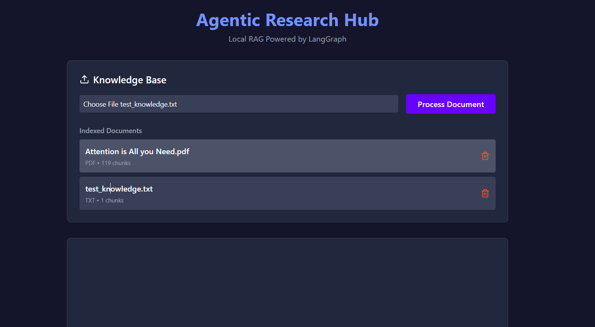
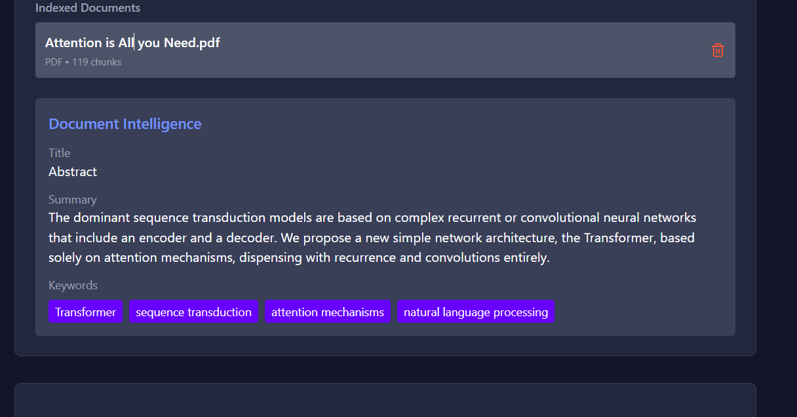
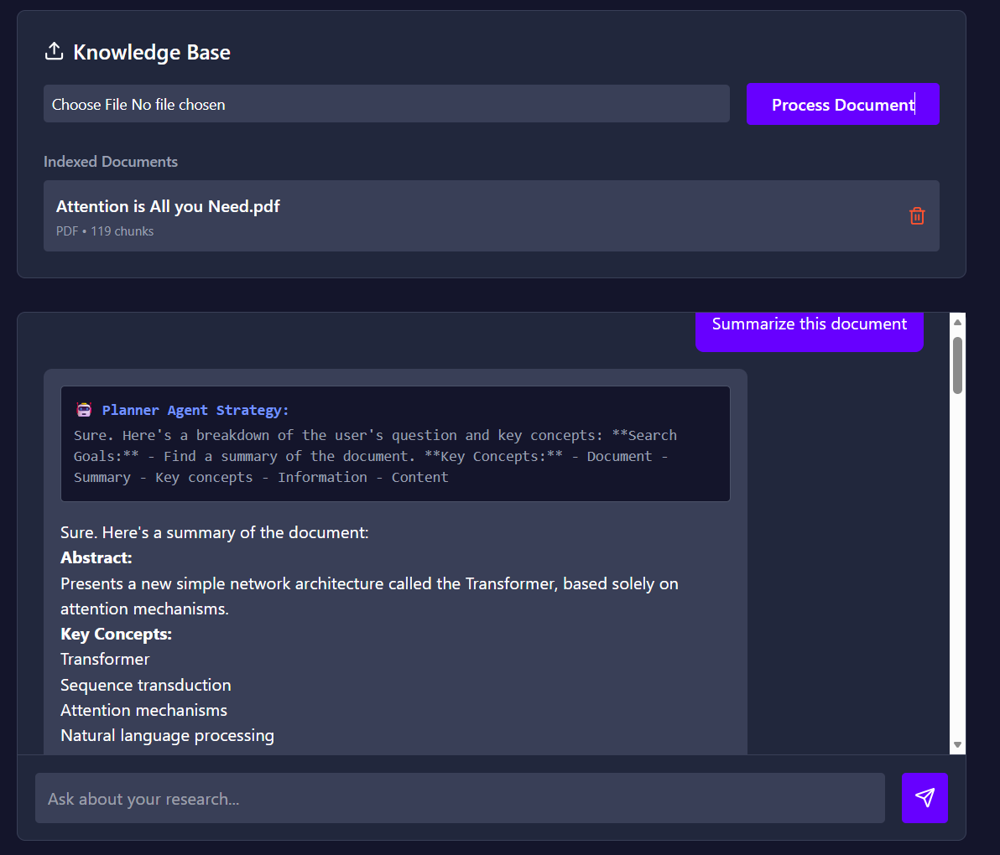
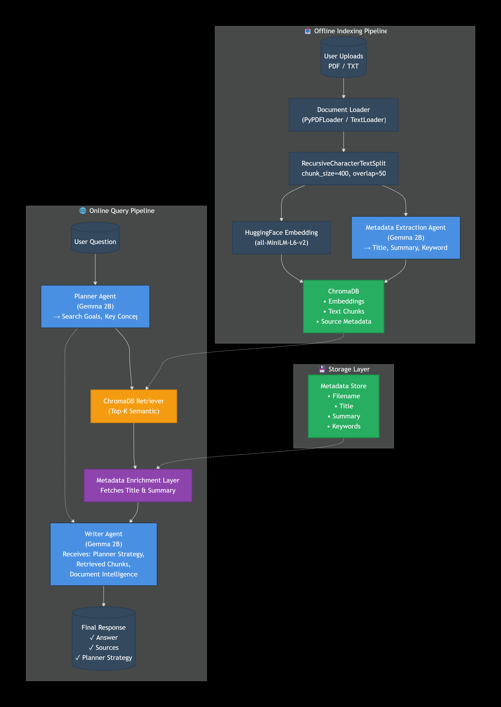

# Agentic Research Hub

[](https://github.com/trilokdhakad/agentic-research-hub)
[](https://hub.docker.com/r/tt49139/agentic-research-hub)

An Agentic Retrieval-Augmented Generation (RAG) system built using **LangGraph**, **FastAPI**, **React**, **ChromaDB**, and **Ollama**.

The system allows users to upload PDF and TXT documents, automatically extract document intelligence (title, summary, and keywords), generate embeddings, store semantic representations in ChromaDB, and query the knowledge base through a metadata-aware multi-agent workflow.

Unlike traditional RAG systems that directly retrieve and generate responses, this project introduces a planning layer that helps guide retrieval before answer generation. The retrieval pipeline combines document-level intelligence with chunk-level semantic search, enabling both high-level understanding and fact-grounded question answering.

## 🔗 Links

- **GitHub Repository:** https://github.com/trilokdhakad/agentic-research-hub
- **Docker Image:** https://hub.docker.com/r/tt49139/agentic-research-hub

---

# ✨ Features

## 📄 Document Management

* Upload PDF and TXT documents
* Automatic text chunking and embedding generation
* Duplicate document protection
* Document deletion from the knowledge base
* Indexed document dashboard with chunk statistics

## 🧠 Agentic RAG Pipeline

* Planner Agent generates retrieval goals and key concepts
* Semantic Retriever fetches relevant chunks from ChromaDB
* Metadata Enrichment Layer injects document intelligence
* Writer Agent synthesizes grounded responses
* Source attribution for every answer
* Built using LangGraph state-driven workflows

## 🔍 Document Intelligence

* Automatic metadata extraction during upload
* Title generation
* Summary generation
* Keyword extraction
* Metadata persistence and retrieval
* Interactive metadata viewer in the frontend

## 💻 Fully Local AI Stack

* Local LLM execution using Ollama
* Local vector database using ChromaDB
* HuggingFace sentence-transformer embeddings
* No external API dependency required

## 🐳 Docker Support

* Dockerized FastAPI backend
* Dockerized React frontend
* One-command deployment using Docker Compose
* Reproducible local development environment

---

# 🏗️ Architecture

```text
                    ┌────────────────────┐
                    │ PDF / TXT Document │
                    └─────────┬──────────┘
                              │
                              ▼
                    ┌────────────────────┐
                    │ Document Loader    │
                    └─────────┬──────────┘
                              │
                              ▼
                    ┌────────────────────┐
                    │ Text Chunking      │
                    └─────────┬──────────┘
                              │
             ┌────────────────┴──────────────┐
             ▼                               ▼

┌────────────────────┐          ┌────────────────────┐
│ Metadata Extractor │          │ Embedding Model    │
│ Gemma 2B           │          │ MiniLM-L6-v2       │
└─────────┬──────────┘          └─────────┬──────────┘
          │                               │
          ▼                               ▼

┌────────────────────┐          ┌────────────────────┐
│ Metadata Store     │          │ ChromaDB           │
└────────────────────┘          └─────────┬──────────┘
                                          │
                                          ▼

                              ┌────────────────────┐
                              │ User Question      │
                              └─────────┬──────────┘
                                        │
                                        ▼

                              ┌────────────────────┐
                              │ Planner Agent      │
                              └─────────┬──────────┘
                                        │
                                        ▼

                              ┌────────────────────┐
                              │ Semantic Retriever │
                              └─────────┬──────────┘
                                        │
                                        ▼

                              ┌────────────────────┐
                              │ Metadata Enrichment│
                              └─────────┬──────────┘
                                        │
                                        ▼

                              ┌────────────────────┐
                              │ Writer Agent       │
                              └─────────┬──────────┘
                                        │
                                        ▼

                              ┌────────────────────┐
                              │ Final Answer       │
                              └────────────────────┘

```

---

# 🧠 Multi-Agent Workflow

```text
Question
    │
    ▼
Planner Agent
    │
    ▼
Semantic Retrieval
    │
    ▼
Metadata Enrichment
    │
    ▼
Writer Agent
    │
    ▼
Answer + Sources + Strategy

```

---

# 🛠️ Tech Stack

## Frontend

* React
* Vite
* Tailwind CSS
* Axios
* Lucide React

## Backend

* FastAPI
* Python

## AI & Orchestration

* LangChain
* LangGraph
* Ollama (Gemma 2B)

## Vector Database

* ChromaDB

## Embeddings

* HuggingFace Sentence Transformers
* all-MiniLM-L6-v2

---

# 📂 Project Structure

```text
agentic-research-hub/
│
├── backend/
│   ├── main.py
│   ├── rag_graph.py
│   ├── database.py
│   ├── document_utils.py
│   ├── metadata_extractor.py
│   ├── metadata_store.py
│   ├── requirements.txt
│   ├── Dockerfile
│   └── .dockerignore
│
├── frontend/
│   ├── src/
│   ├── public/
│   ├── package.json
│   ├── Dockerfile
│   └── .dockerignore
│
├── docker-compose.yml
├── screenshots/
├── README.md
└── .gitignore

```

---

# 🐳 Docker Deployment

## Prerequisites

* Docker Desktop
* Ollama
* Gemma 2B model

Pull the model:

```bash
ollama pull gemma:2b

```

Run the application:

```bash
docker compose up --build

```

Services:

* Frontend: http://localhost:5173
* Backend:  http://localhost:8000

Docker Hub Image:

```bash
docker pull tt49139/agentic-research-hub:latest

```

---

# 🚀 Getting Started

## Prerequisites

* Python 3.10+
* Node.js 18+
* Ollama

Install Ollama:

https://ollama.com

Pull the required model:

```bash
ollama pull gemma:2b

```

Verify installation:

```bash
ollama list

```

Start Ollama:

```bash
ollama serve

```

---

## Backend Setup

```bash
cd backend

python -m venv venv

# Windows
venv\Scripts\activate

# Linux/macOS
source venv/bin/activate

pip install -r requirements.txt

uvicorn main:app --reload

```

Backend:

```text
http://localhost:8000

```

---

## Frontend Setup

```bash
cd frontend

npm install

npm run dev

```

Frontend:

```text
http://localhost:5173

```

---

# 🔄 Workflow

## Upload Phase

```text
Document
    │
    ▼
Document Loader
    │
    ▼
Chunking
    │
    ├── Metadata Extraction
    │
    └── Embedding Generation
            │
            ▼
        ChromaDB

```

## Question Answering Phase

```text
Question
    │
    ▼
Planner Agent
    │
    ▼
Retriever
    │
    ▼
Metadata Enrichment
    │
    ▼
Writer Agent
    │
    ▼
Answer + Sources

```

---

# 🎯 Challenges Solved

## Multi-Agent Coordination

Implemented a LangGraph workflow where separate agents perform planning, retrieval, and response generation while sharing a common state.

## Metadata-Aware Retrieval

Combined document-level intelligence (title and summary) with chunk-level semantic retrieval, improving high-level document understanding while preserving factual grounding.

## Metadata Extraction from Local Models

Built a metadata extraction pipeline capable of generating document summaries and keywords using a lightweight local LLM.

## Duplicate Document Handling

Prevented duplicate embeddings and duplicate storage by validating uploaded documents before indexing.

## Local-First Architecture

Designed the system to run entirely on local hardware without requiring cloud-hosted LLM APIs.

---

# 🔮 Future Improvements

* Hybrid Retrieval (Vector + BM25)
* Cross-Encoder Reranking
* Conversational Memory
* Multi-Document Reasoning
* Citation Highlighting
* Streaming Responses
* Cloud-Hosted LLM Backend Option

---

# 📸 Screenshots

## Knowledge Base & Document Management



## Document Intelligence



## Planner Agent & Answer Generation



## System Architecture



---

# 👨‍💻 Author

Built to explore:

* Agentic AI Systems
* Retrieval-Augmented Generation (RAG)
* LangGraph Workflows
* Local LLM Deployment
* Document Intelligence Systems
* Metadata-Aware Retrieval

```

```
